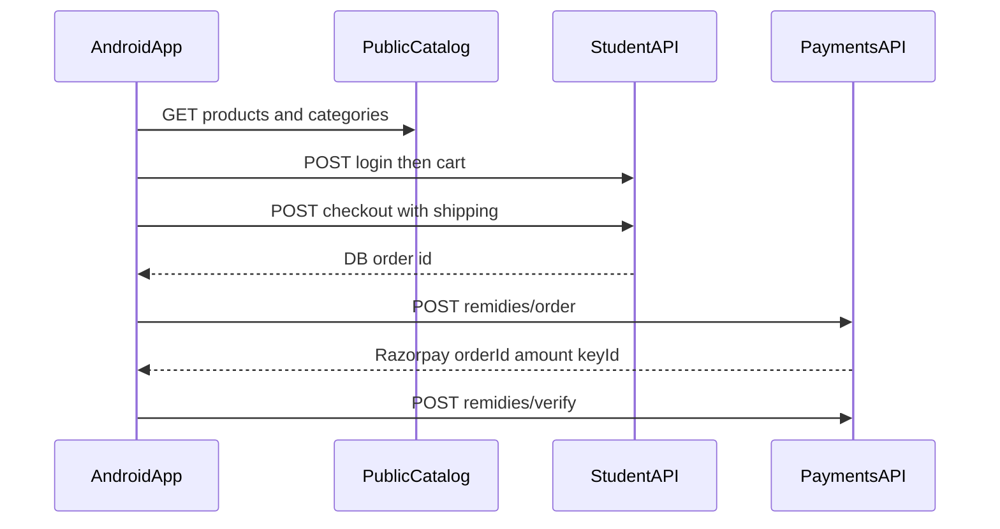

# Android shop (products) API reference

Shop (remedies/products) APIs for the customer Android app. Catalog is public; cart, checkout, and orders require a student JWT; payments go through Razorpay.

**Base URL**

| Environment | URL |
|---|---|
| Production | `https://api.vastuarunsharma.com` |
| Local (website default) | `http://localhost:3030` |
| Local (backend `PORT`) | often `http://localhost:3000` |

**Response envelope**

Shop routes return:

```json
{ "success": true, "data": ... }
```

Unwrap `data` on success. On failure read `error` or `message`. Auth uses the same shape. Razorpay **create order** returns the payment payload **without** the `{ success, data }` wrap.

**Auth header**

```
Authorization: Bearer <jwt>
```

Obtain the JWT from `POST /auth/login`. All IDs are UUIDs. Use `Content-Type: application/json`. Native Android does not need CORS.

**Recommended prefixes** (same as the website)

| Purpose | Prefix |
|---|---|
| Catalog (no login) | `/api/public/remidies/...` |
| Cart / orders (login) | `/api/student/remidies/...` |
| Pay | `/api/payments/remidies/...` |

Aliases exist (`/api/student/remidies` catalog, `/api/remidies/user/...`) — do not mix prefixes in the app.



---

## 1. Auth (needed for cart)

### `POST /auth/login`

**Body**

```json
{ "email": "user@example.com", "password": "secret" }
```

**Response** `{ success, data: { token, user } }`

### `POST /auth/register`

**Body**

```json
{
  "email": "user@example.com",
  "password": "secret",
  "name": "Full Name",
  "phoneNumber": "9876543210"
}
```

`phoneNumber` must be at least 10 characters.

### `GET /auth/me`

Bearer required. Returns the current user.

### `POST /api/student/logout`

Bearer required. Invalidates the token.

---

## 2. Public catalog (no auth)

Public handlers always filter `isActive: true` and **strip** cost/stock fields:

- `stock`
- `purchasePrice`
- `lastPurchasePrice`
- `inventoryValue`
- `lowStockThreshold`
- `lowStockAlertSentAt`

Image URLs are signed Cloudinary links. There is **no `inStock` flag** on public products; stock is enforced only when adding to cart or checking out.

### `GET /api/public/remidies/categories`

**Response `data`:** array of

```json
{
  "id": "uuid",
  "name": "Yantras",
  "description": "...",
  "image": "https://res.cloudinary.com/...",
  "createdAt": "...",
  "updatedAt": "..."
}
```

### `GET /api/public/remidies/products/all`

| Query | Required | Notes |
|---|---|---|
| `categoryId` | no | UUID |

**Response:** `{ success, data: Product[], total }`

Use this for a full catalog screen.

### `GET /api/public/remidies/products`

| Query | Required | Default | Notes |
|---|---|---|---|
| `page` | no | `1` | |
| `limit` | no | `10` | |
| `categoryId` | no | | UUID |

**Response:** `{ success, data: Product[], meta: { total, page, limit, totalPages } }`

Use this for paged lists. Do **not** send `isActive`; the server always filters active.

### `GET /api/public/remidies/products/:id`

404 if missing or inactive.

### `GET /api/public/remidies/products/slug/:slug`

Slug is **not stored**. It is derived from the product name:

- lowercase
- trim
- drop non-word characters
- spaces → `-`

404 if no active match.

### Public product JSON (typical)

```json
{
  "id": "uuid",
  "name": "Brass Pyramid",
  "description": "...",
  "images": ["https://res.cloudinary.com/..."],
  "price": 1499,
  "rate": 1499,
  "isActive": true,
  "categoryId": "uuid",
  "category": {
    "id": "uuid",
    "name": "...",
    "description": "...",
    "image": "..."
  },
  "createdAt": "...",
  "updatedAt": "..."
}
```

`rate` is a duplicate of `price`. Prefer `price` in the app.

---

## 3. Cart, coupons, orders (Bearer required)

Mounted under `/api/student/remidies`. Same handlers also exist at `/api/remidies/user/...`.

### Cart

#### `GET /api/student/remidies/cart`

Creates an empty cart if the user has none.

#### `POST /api/student/remidies/cart`

```json
{ "productId": "uuid", "quantity": 1 }
```

`quantity` must be an integer ≥ 1.

#### `PUT /api/student/remidies/cart/:productId`

```json
{ "quantity": 2 }
```

#### `DELETE /api/student/remidies/cart/:productId`

**Cart `data` shape**

```json
{
  "id": "uuid",
  "userId": "uuid",
  "items": [
    {
      "quantity": 1,
      "lineTotal": 1499,
      "product": {
        "id": "uuid",
        "name": "...",
        "price": 1499,
        "rate": 1499,
        "stock": 5,
        "images": ["..."],
        "categoryId": "uuid"
      }
    }
  ],
  "subtotal": 1499,
  "itemCount": 1
}
```

Cost fields are stripped from nested products. Nested `product.stock` is the availability signal after login.

**Common errors**

| Message | Cause |
|---|---|
| `Insufficient stock. Available: N` | Requested qty exceeds stock |
| `Product is not active` | Product deactivated |

### Coupons

#### `GET /api/student/remidies/coupons`

Coupons available to this user (assigned and/or global, per server rules).

#### `POST /api/student/remidies/coupons/validate`

```json
{ "couponCode": "SAVE10" }
```

Code is uppercased server-side.

**Validate `data`**

```json
{
  "code": "SAVE10",
  "discountType": "PERCENTAGE",
  "discountValue": 10,
  "usesRemaining": 3,
  "expiresAt": "2026-12-31T00:00:00.000Z",
  "productScope": "ALL",
  "applicableProducts": [],
  "applicableCategories": [],
  "eligibleSubtotal": 1499,
  "discountAmount": 149.9
}
```

`discountType`: `PERCENTAGE` | `FIXED`  
`productScope`: `ALL` | `SPECIFIC` | `CATEGORY`  
`eligibleSubtotal` / `discountAmount` are present only when the cart is non-empty.

### Checkout

#### `POST /api/student/remidies/checkout`

Creates a DB order, clears the cart, and decrements stock.

```json
{
  "shippingName": "Full Name",
  "shippingPhone": "9876543210",
  "shippingAddress": "Line 1",
  "shippingCity": "Delhi",
  "shippingState": "Delhi",
  "shippingPostal": "110001",
  "couponCode": "OPTIONAL"
}
```

**Response** `201`

```json
{
  "success": true,
  "data": {
    "order": { "id": "uuid", "status": "PENDING", "...": "..." },
    "payment": { "...": "..." },
    "breakdown": { "...": "..." },
    "stockChanges": []
  }
}
```

Use **`data.order.id`** as the database order id for Razorpay. Order status starts as `PENDING`. Cart is emptied immediately — persist this id until payment verify succeeds.

### Orders

#### `GET /api/student/remidies/orders`

Returns the user's orders with `items.product`, `payment`, and numeric amounts.

Relevant statuses include `PENDING`, `PAID`, plus admin-updated fulfillment statuses.

---

## 4. Product payment (Razorpay)

Same flow as the website cart checkout.

### Step 1 — Create Razorpay order

`POST /api/payments/remidies/order`

```json
{ "orderId": "<data.order.id from checkout>" }
```

**Response (unwrapped):**

```json
{
  "orderId": "order_RazorpayId",
  "amount": 149900,
  "currency": "INR",
  "keyId": "rzp_..."
}
```

| Field | Meaning |
|---|---|
| `orderId` | **Razorpay** order id (not the DB order id) |
| `amount` | Amount in **paise** |
| `keyId` | Razorpay key for Checkout / Android SDK |

### Step 2 — Open Razorpay Checkout / Android SDK

Pass `keyId`, Razorpay `orderId`, `amount`, and `currency`.

### Step 3 — Verify payment

`POST /api/payments/remidies/verify`

```json
{
  "orderId": "<database order uuid>",
  "razorpay_order_id": "...",
  "razorpay_payment_id": "...",
  "razorpay_signature": "..."
}
```

**Success:** `{ "success": true, "data": { "success": true, "paymentId": "..." } }` (Result envelope). Order becomes `PAID`.

---

## 5. Do not call from the customer Android app

Admin-only under `/api/admin/remidies` and `/api/remidies/admin` (`requireAdmin`):

- Create / update / delete products and categories
- Stock / WAC adjustments
- Coupons CRUD
- Bulk discount tiers
- POS cash sale
- Inventory summary / dashboard stats

These expose cost and stock internals.

---

## Android client notes

1. Parse `data` from `{ success, data }`; on failure read `error` or `message`.
2. Catalog: `/products/all` for a full list; `/products?page=&limit=` for paging.
3. Filter by category with `?categoryId=<uuid>`.
4. Do not send `isActive` on public list endpoints.
5. After checkout, persist `data.order.id` until verify succeeds; the cart is already empty.
6. `POST /api/student/device-token` is for live-class FCM, not shop.

---

## Kotlin Retrofit models (copy into the Android app)

```kotlin
// ApiEnvelope.kt
data class ApiEnvelope<T>(
    val success: Boolean,
    val data: T? = null,
    val error: Any? = null,
    val message: String? = null,
    val total: Int? = null,
    val meta: PageMeta? = null,
)

data class PageMeta(
    val total: Int,
    val page: Int,
    val limit: Int,
    val totalPages: Int,
)
```

```kotlin
// AuthModels.kt
data class LoginRequest(val email: String, val password: String)

data class RegisterRequest(
    val email: String,
    val password: String,
    val name: String,
    val phoneNumber: String,
)

data class AuthData(
    val token: String,
    val user: AuthUser,
)

data class AuthUser(
    val id: String,
    val email: String,
    val name: String?,
    val role: String?,
    val phoneNumber: String? = null,
)
```

```kotlin
// ShopModels.kt
data class Category(
    val id: String,
    val name: String,
    val description: String? = null,
    val image: String? = null,
    val createdAt: String? = null,
    val updatedAt: String? = null,
)

data class ProductCategory(
    val id: String,
    val name: String,
    val description: String? = null,
    val image: String? = null,
)

data class Product(
    val id: String,
    val name: String,
    val description: String? = null,
    val images: List<String> = emptyList(),
    val price: Double,
    val rate: Double? = null,
    val isActive: Boolean? = null,
    val categoryId: String? = null,
    val category: ProductCategory? = null,
    val stock: Int? = null, // present on cart nested product; stripped on public catalog
    val createdAt: String? = null,
    val updatedAt: String? = null,
)

data class CartItem(
    val id: String? = null,
    val quantity: Int,
    val lineTotal: Double? = null,
    val product: Product,
)

data class Cart(
    val id: String,
    val userId: String,
    val items: List<CartItem> = emptyList(),
    val subtotal: Double = 0.0,
    val itemCount: Int = 0,
)

data class AddToCartRequest(
    val productId: String,
    val quantity: Int = 1,
)

data class UpdateCartQuantityRequest(
    val quantity: Int,
)

data class ValidateCouponRequest(
    val couponCode: String,
)

data class CouponValidateResult(
    val code: String,
    val discountType: String,
    val discountValue: Double,
    val usesRemaining: Int? = null,
    val expiresAt: String? = null,
    val productScope: String? = null,
    val applicableProducts: List<Product>? = null,
    val applicableCategories: List<Any>? = null,
    val eligibleSubtotal: Double? = null,
    val discountAmount: Double? = null,
)

data class ShippingDetails(
    val shippingName: String,
    val shippingPhone: String,
    val shippingAddress: String,
    val shippingCity: String,
    val shippingState: String,
    val shippingPostal: String,
    val couponCode: String? = null,
)

data class CheckoutOrder(
    val id: String,
    val status: String? = null,
)

data class CheckoutResult(
    val order: CheckoutOrder,
)

data class RemediesRazorpayOrder(
    val orderId: String,   // Razorpay order id
    val amount: Long,      // paise
    val currency: String? = "INR",
    val keyId: String? = null,
)

data class RemediesPaymentVerifyRequest(
    val orderId: String, // database order uuid
    val razorpay_order_id: String,
    val razorpay_payment_id: String,
    val razorpay_signature: String,
)
```

```kotlin
// ShopApi.kt — Retrofit interfaces
import retrofit2.http.*

interface AuthApi {
    @POST("auth/login")
    suspend fun login(@Body body: LoginRequest): ApiEnvelope<AuthData>

    @POST("auth/register")
    suspend fun register(@Body body: RegisterRequest): ApiEnvelope<AuthData>

    @GET("auth/me")
    suspend fun me(): ApiEnvelope<AuthUser>

    @POST("api/student/logout")
    suspend fun logout()
}

interface PublicShopApi {
    @GET("api/public/remidies/categories")
    suspend fun getCategories(): ApiEnvelope<List<Category>>

    @GET("api/public/remidies/products/all")
    suspend fun getAllProducts(
        @Query("categoryId") categoryId: String? = null,
    ): ApiEnvelope<List<Product>>

    @GET("api/public/remidies/products")
    suspend fun getProducts(
        @Query("page") page: Int? = null,
        @Query("limit") limit: Int? = null,
        @Query("categoryId") categoryId: String? = null,
    ): ApiEnvelope<List<Product>>

    @GET("api/public/remidies/products/{id}")
    suspend fun getProductById(@Path("id") id: String): ApiEnvelope<Product>

    @GET("api/public/remidies/products/slug/{slug}")
    suspend fun getProductBySlug(@Path("slug") slug: String): ApiEnvelope<Product>
}

interface StudentShopApi {
    @GET("api/student/remidies/cart")
    suspend fun getCart(): ApiEnvelope<Cart>

    @POST("api/student/remidies/cart")
    suspend fun addToCart(@Body body: AddToCartRequest): ApiEnvelope<Cart>

    @PUT("api/student/remidies/cart/{productId}")
    suspend fun updateCartItem(
        @Path("productId") productId: String,
        @Body body: UpdateCartQuantityRequest,
    ): ApiEnvelope<Cart>

    @DELETE("api/student/remidies/cart/{productId}")
    suspend fun removeCartItem(@Path("productId") productId: String): ApiEnvelope<Cart>

    @GET("api/student/remidies/coupons")
    suspend fun getMyCoupons(): ApiEnvelope<List<Any>>

    @POST("api/student/remidies/coupons/validate")
    suspend fun validateCoupon(@Body body: ValidateCouponRequest): ApiEnvelope<CouponValidateResult>

    @POST("api/student/remidies/checkout")
    suspend fun checkout(@Body body: ShippingDetails): ApiEnvelope<CheckoutResult>

    @GET("api/student/remidies/orders")
    suspend fun getOrders(): ApiEnvelope<List<Any>>
}

interface PaymentsApi {
    @POST("api/payments/remidies/order")
    suspend fun createRemediesOrder(@Body body: Map<String, String>): RemediesRazorpayOrder

    @POST("api/payments/remidies/verify")
    suspend fun verifyRemediesPayment(@Body body: RemediesPaymentVerifyRequest): ApiEnvelope<Any>
}
```

**OkHttp auth interceptor (sketch)**

```kotlin
class AuthInterceptor(private val tokenProvider: () -> String?) : Interceptor {
    override fun intercept(chain: Interceptor.Chain): Response {
        val token = tokenProvider()
        val request = if (token.isNullOrBlank()) {
            chain.request()
        } else {
            chain.request().newBuilder()
                .header("Authorization", "Bearer $token")
                .build()
        }
        return chain.proceed(request)
    }
}
```

Wire Retrofit with `baseUrl` = production or local base URL (trailing `/`), Gson/Moshi, and attach `AuthInterceptor` only to authenticated clients (`StudentShopApi`, `PaymentsApi`, `AuthApi.me` / logout).

---

## Source of truth in this monorepo

| Area | File |
|---|---|
| Catalog / cart / admin routes | `src/remidies/remidies.routes.ts` |
| Mount: public | `src/routes/public.routes.ts` |
| Mount: student | `src/routes/student.routes.ts` |
| Mount: remidies user/admin | `src/routes/remidies.route.ts` |
| Payments | `src/routes/payment.routes.ts` |
| Website catalog client | `vastuarunsharma.com/api/public.ts` |
| Website cart client | `vastuarunsharma.com/api/shop.ts` |
| Website Razorpay client | `vastuarunsharma.com/api/payments.ts` |
